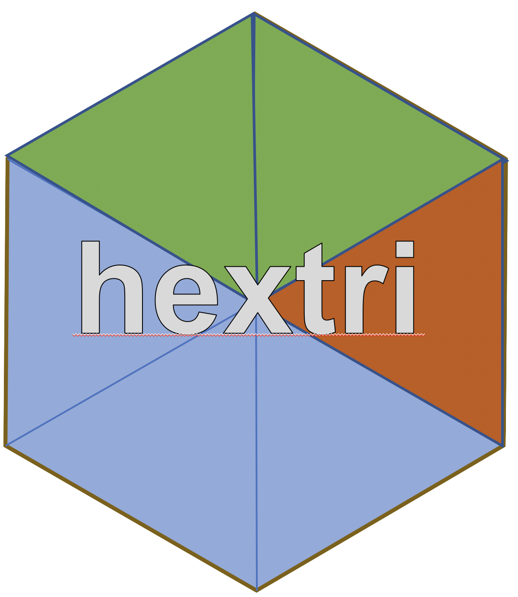

# hextri
hexagonal binning with triangular sub-binning

This package creates hexbin plots for multi-category data. Each hex is split into six triangles, 
and these are allocated in proportion to the counts for the categories.  It's a kind of glyph plot.

### NO, it's not a pie chart
